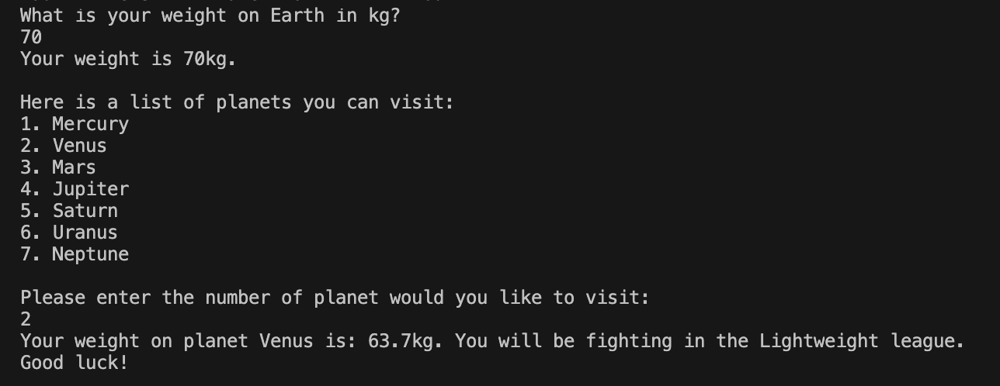

# GALAXY BOXING

## Space Conversion Game Written in C++

### Laura Ashcroft

#### A short, fun game using multiplication to tell you what league you would be in across the galaxy!

### This game demonstrates:

- Assigning variables as double, int, and string to create a diverse game
- Using std::cin to store player input and use that throughout the code
- Using a series of if/else if conditions to determine what league the player is entered into dependent on their Earth weight
- Using a series of if/else if conditions to determine what planet the player has chosen, and the calculation to show their 'new' weight on other planets
- Using std::cout to display messages to the player and create a dynamic, immersive game.

## How to use

1. Enter your, someones else's or a random weight as it is on Earth.
2. Select a planet to visit.
3. Read the results!

## Installation

1. Clone or download this repository.
2. Compile the file by entering 'g++ space.cpp' into the terminal
3. Execute the file by entering './a.out' into the terminal
4. The game will start!
